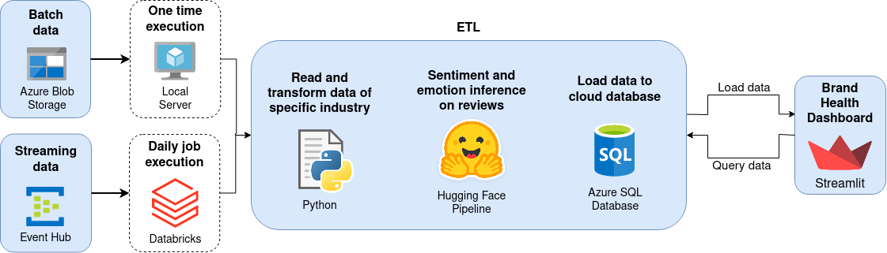
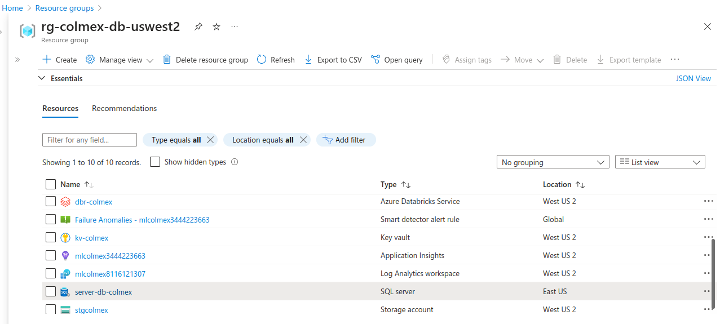
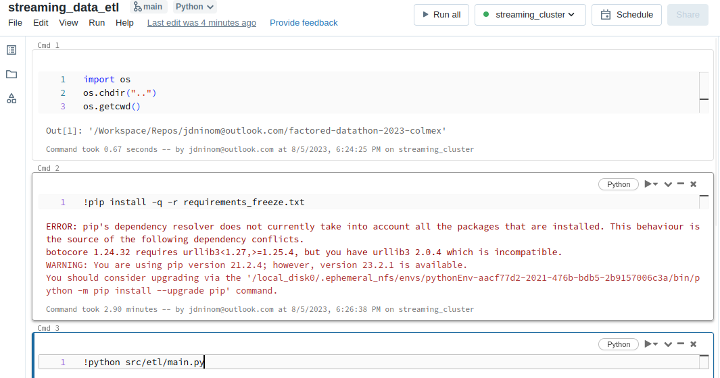
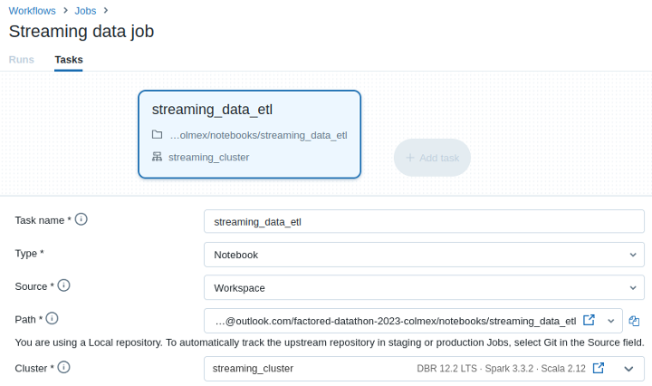
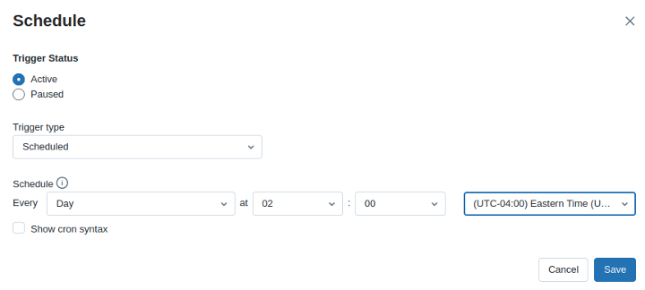
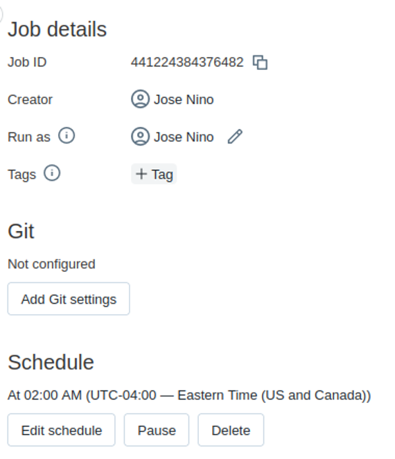

# Factored Datathon 2023: Sentiment Analysis on Amazon Reviews

This project was developed as part of a Factored-Datathon, focusing on sentiment analysis of Amazon reviews. The goal was to create an end-to-end solution, including a sentiment analysis NLP model, a complete ETL process for both batch and streaming data, transformation, and loading of data into an Azure Databricks database, and a dashboard deployed using Streamlit.

This project was powered by ColMex Team

## Project Structure

The repository is structured as follows:

* data_files: Contains additional data files used in the analysis and testing.
* notebook: Contains notebooks for data analysis, model setup tests, database connection tests, and data processing tests.

    For data processing journey
    1. [1_download_batch_data.ipynb](notebooks/1_download_batch_data.ipynb)
    2. [2_load_batch_data](notebooks/2_load_batch_data.ipynb)
    3. [3_explore_batch_data](notebooks/3_explore_batch_data.ipynb)
    4. [4_streaming_data_acquisition](notebooks/4_streaming_data_acquisition.ipynb)
    5. [5_streaming_data_analysis](notebooks/5_streaming_data_analysis.ipynb)
    6. [6_transform_batch_streaming_data](notebooks/6_transform_batch_streaming_data.ipynb)
    7. [7_write_sql](notebooks/7_write_sql.ipynb)
    8. [8_create_sql_tables](notebooks/8_create_sql_tables.ipynb)
    9. [9_streamlit_app_queries](notebooks/9_streamlit_app_queries.ipynb)

    For Data analysis
    1. ColMex_Team_DA_Process_2023_Datathon_Part_I
    2. ColMex_Team_DA_Process_2023_Datathon_Part_II
    3. ColMex_Team_DA_Process_2023_Datathon_Stream_decision
    4. ColMex_Team_DA_Process_2023_Datathon_Part_III

* src:
    1. etl: Contains modules for ETL functions, including extraction from batch and streaming data, transformation functions to apply database standards, and loading data to the database. NOTE: THIS FILES CONTAIN ALL FUNCTIONS AND PIPELINE TO EXECUTE THE SOLUTION AUTO
    2. main.py: Main script to execute the ETL pipeline automatically.
* Cloud solution:
    The solution is completly a cloud integrated solution.

    **System Architecture**
    This solution execute it one time per day and extract all the streaming data available since the last record extracted in the data base until the last record available 

    NOTE: This solution shows the results for the last stream data available and updated one time per day.

    
    

    **ETL execution program:**
    We use a DataBricks IaaS solution creating a cluster virtual machine to execute the ETL programmatically. This solution execute the prompt "python src/etl/main.py" one time per day and automatically extract/transform/load the data. All the data are managed in RAM and is not stored in intermediate step.

    
    
    
    
    

* application: Contains files for connecting to the database and displaying the results in the dashboard.

## Setup and Installation

To set up the project locally, please follow these steps:

Clone the repository: git clone https://github.com/Col-Mex/factored-datathon-2023-colmex.git
Install the required dependencies: pip install -r requirements.txt
Set up the necessary credentials for accessing the data sources, Azure Databricks, and the database.
Follow the instructions in each subdirectory to run the specific components of the project.

## Usage

* Data Extraction: Load the functions from src/etl/extract folder on extract.py or extract_stream.py (from batch or stream data) (https://github.com/Col-Mex/factored-datathon-2023-colmex/blob/main/src/etl/extract/main.py contains the pipeline of extraction batch data)
* Data Transformation: Load the functions from src/etl/transform folder on transform.py (https://github.com/Col-Mex/factored-datathon-2023-colmex/blob/main/src/etl/transform/main.py contains the pipeline of transform batch data)
* Data Loading: Load the functions from src/etl/load folder on load.py to load the transformed data into an Azure Databricks database.
* Data Analysis: Explore the notebooks in the notebook directory for data analysis, model setup tests, database connection tests, and data processing tests.
* ETL Automation: Execute the main.py script in the src/etl directory to run the ETL pipeline automatically (https://github.com/Col-Mex/factored-datathon-2023-colmex/blob/main/src/etl/main.py) - This pipeline is the main pipeline to Extract/Transform/Load the streaming data.
* Application: Use the files in the application directory to connect to the database and display the results in the dashboard.

## Contributors

José Niño
Eduardo Avelar
Rodrigo Quezada
Andrés Rocha

From ColMex Team

This project is licensed under the MIT License.

Feel free to modify and adapt the project according to your needs. If you have any questions or suggestions, please feel free to contact us.

**Research notes**

Justifying Recommendations using Distantly-Labeled Reviews and Fine-Grained Aspects  
[[site](https://aclanthology.org/D19-1018/)] [[pdf](https://aclanthology.org/D19-1018.pdf)] [[slide](https://nijianmo.github.io/slides/emnlp-19a.pdf)] [[repo](https://github.com/nijianmo/recsys_justification)] [[cites](https://scholar.google.com/scholar?oi=bibs&hl=en&cites=15486505894554216965)]

This paper introduces the [Amazon Review Data (2018)](https://nijianmo.github.io/amazon/index.html) dataset.

[research.md](research.md) - Here we investigated other articles that cited the article above. 

**Batch Data source acquisition**

[1_download_batch_data.ipynb](notebooks/1_download_batch_data.ipynb) - Download **.gz** files of Amazon products reviews and metadata.
* Amazon Product Reviews - 22.4 GB
* Amazon Metadata - 11.8 GB

[2_load_batch_data](notebooks/2_load_batch_data.ipynb) - Load data using Spark to get initial schemas.
* [amazon_reviews_schema.json](data_files/amazon_reviews_schema.json)
* [amazon_metadata_raw_schema.json](data_files/amazon_metadata_raw_schema.json)

[3_explore_batch_data](notebooks/3_explore_batch_data.ipynb) - Query data for EDA.

**Batch Data source exploration**

Number of reviews: 139,832,500 raw, 138,482,432 unique

Number of metadata: 15,023,059 raw, 14,741,571 unique

[metadata_main_cats_raw.json](data_files/metadata_main_cats_raw.json)

[metadata_main_cats.json](data_files/metadata_main_cats.json) - Cleaned main_cats

52 categories + 1 without category. 'Beats by Dr. Dre' seems to be a wrong value for a category so isn't consider as one.

[num_reviews_by_main_cat.json](data_files/num_reviews_by_main_cat.json) - 
Number of review by category using unique samples.

[num_metadata_by_main_cat.json](data_files/num_metadata_by_main_cat.json) - 
Number of metadata by category using unique samples.

Number of reviews with product metadata: 137,759,876

Number of reviews without product metadata: 722,556

**Batch Data Selection**

[software_asins.json](data_files/software_asins.json) - asins of Software `main_cat` from metadata.

**Streaming Data acquisition**

[4_streaming_data_acquisition.ipynb](notebooks/4_streaming_data_acquisition.ipynb) - Streaming data acquisition notes

[recv_stream_data_async.py](scripts/recv_stream_data_async.py) - Basic script to receive stream data.

**Streaming Data analysis**

[5_streaming_data_analysis.ipynb](notebooks/5_streaming_data_analysis.ipynb) - Analysis of streaming data.

**Data Preprocessing notes**

[data_prep_notes.md](data_prep_notes.md) - Previous work is examined to avoid pitfalls related to data preparation.

**Documents/Files storage**

A shared Google Drive [folder](https://drive.google.com/drive/folders/1RFptM5LDdVLjcFN5d3IdXtjWexsLs_oD) was created to storage documents and big files to work collaboratively.

**Data Preprocessing notes**

## Project Organization
** Sample folder needed for batch data

    ├── notebooks                   <- Utils notebooks
    ├── data_files                  <- Data utils
    ├── images                      <- Image utils
    ├── jsons                       <- Configurations files
    ├── data_prep_notes             <- notes
    ├── README.md                   <- The top-level README for developers using this project.
    ├── reseatch.md                 <- Literature review
    ├── src/etl
    │   ├── extract                 <- Exatract functions
    │   ├── transform               <- Transform functions
    │   └── load                    <- Load functions
    └── sample                      <- Sample folder
        ├── review_data             <- Review data partitions
        ├── review_data_sample      <- Review data samples
        |   ├── partitions          <- partitions of data
        |   └── filtered            <- filtered data
        ├── review_metadata         <- Review metadata partitions
        └── review_data_metasample  <- Review metadata samples
            ├── partitions          <- partitions of metadata
            └── filtered            <- filtered metadata

 