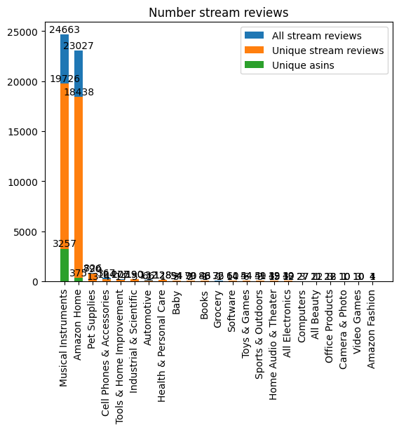
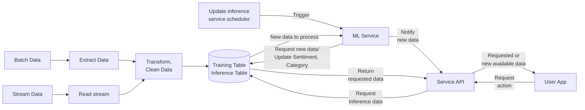

# Factored Datathon 2023 project

**Research notes**

Justifying Recommendations using Distantly-Labeled Reviews and Fine-Grained Aspects  
[[site](https://aclanthology.org/D19-1018/)] [[pdf](https://aclanthology.org/D19-1018.pdf)] [[slide](https://nijianmo.github.io/slides/emnlp-19a.pdf)] [[repo](https://github.com/nijianmo/recsys_justification)] [[cites](https://scholar.google.com/scholar?oi=bibs&hl=en&cites=15486505894554216965)]

This paper introduces the [Amazon Review Data (2018)](https://nijianmo.github.io/amazon/index.html) dataset.

[research.md](research.md) - Here we investigated other articles that cited the article above. 

**Batch Data source acquisition**

[1_download_batch_data.ipynb](notebooks/1_download_batch_data.ipynb) - Download **.gz** files of Amazon products reviews and metadata.
* Amazon Product Reviews - 22.4 GB
* Amazon Metadata - 11.8 GB

[2_load_batch_data](notebooks/2_load_batch_data.ipynb) - Load data using Spark to get initial schemas.
* [amazon_reviews_schema.json](data_files/amazon_reviews_schema.json)
* [amazon_metadata_raw_schema.json](data_files/amazon_metadata_raw_schema.json)

[3_explore_batch_data](notebooks/3_explore_batch_data.ipynb) - Query data for EDA.

**Batch Data source exploration**

Number of reviews: 139,832,500 raw, 138,482,432 unique

Number of metadata: 15,023,059 raw, 14,741,571 unique

[metadata_main_cats_raw.json](data_files/metadata_main_cats_raw.json)

[metadata_main_cats.json](data_files/metadata_main_cats.json) - Cleaned main_cats

52 categories + 1 without category. 'Beats by Dr. Dre' seems to be a wrong value for a category so isn't consider as one.

[num_reviews_by_main_cat.json](data_files/num_reviews_by_main_cat.json) - 
Number of review by category using unique samples.

[num_metadata_by_main_cat.json](data_files/num_metadata_by_main_cat.json) - 
Number of metadata by category using unique samples.

Number of reviews with product metadata: 137,759,876

Number of reviews without product metadata: 722,556

**Batch Data Selection**

[software_asins.json](data_files/software_asins.json) - asins of Software `main_cat` from metadata.

**Streaming Data acquisition**

[4_streaming_data_acquisition.ipynb](notebooks/4_streaming_data_acquisition.ipynb) - Streaming data acquisition notes

[recv_stream_data_async.py](scripts/recv_stream_data_async.py) - Basic script to receive stream data.

**Streaming Data analysis**

[5_streaming_data_analysis.ipynb](notebooks/5_streaming_data_analysis.ipynb) - Analysis of streaming data.

**System Architecture proposal**

**Data Preprocessing notes**

[data_prep_notes.md](data_prep_notes.md) - Previous work is examined to avoid pitfalls related to data preparation.

**Documents/Files storage**

A shared Google Drive [folder](https://drive.google.com/drive/folders/1RFptM5LDdVLjcFN5d3IdXtjWexsLs_oD) was created to storage documents and big files to work collaboratively.

**Data Preprocessing notes**

## Project Organization

    ├── notebooks                   <- utils notebooks
    ├── data_prep_notes             <- notes
    ├── README.md                   <- The top-level README for developers using this project.
    ├── reseatch.md                 <- Literature review
    ├── src/etl
    │   ├── extract                 <- Exatract functions
    │   ├── transform               <- Transform functions
    │   └── load                    <- Load functions
    │
    └── sample                      <- Sample folder
        ├── review_data             <- Review data partitions
        ├── review_data_sample      <- Review data samples
        |   ├── partitions          <- partitions of data
        |   └── filtered            <- filtered data
        ├── review_metadata         <- Review metadata partitions
        └── review_data_metasample  <- Review metadata samples
            ├── partitions          <- partitions of metadata
            └── filtered            <- filtered metadata

 